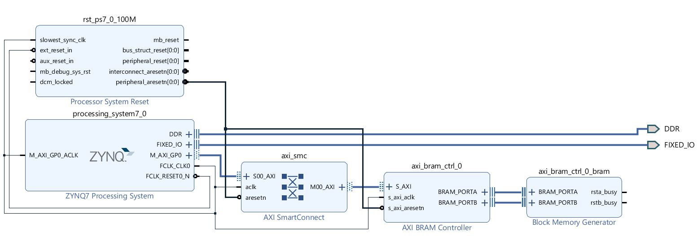
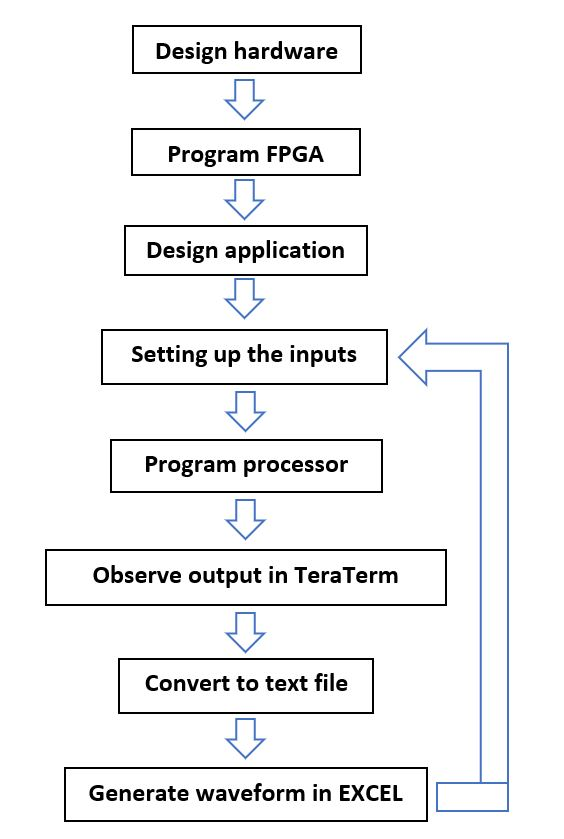
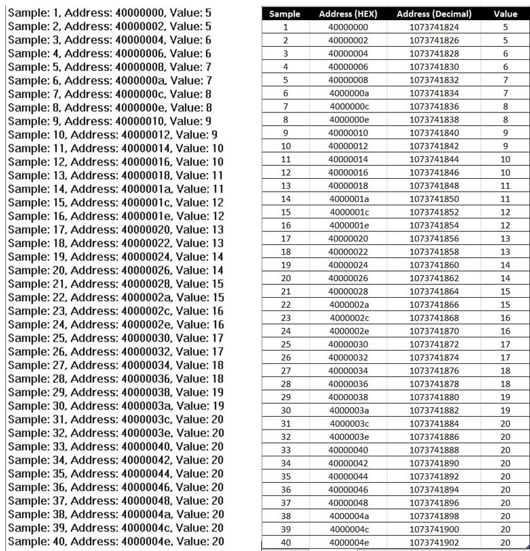
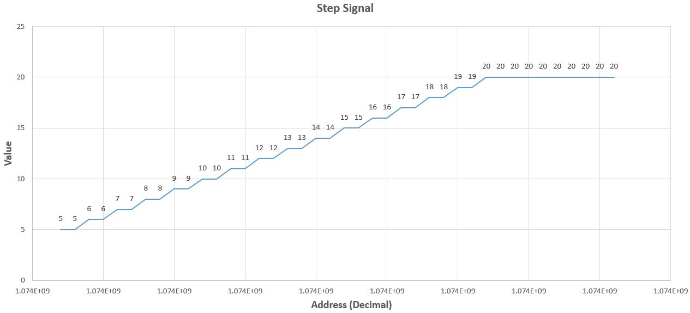
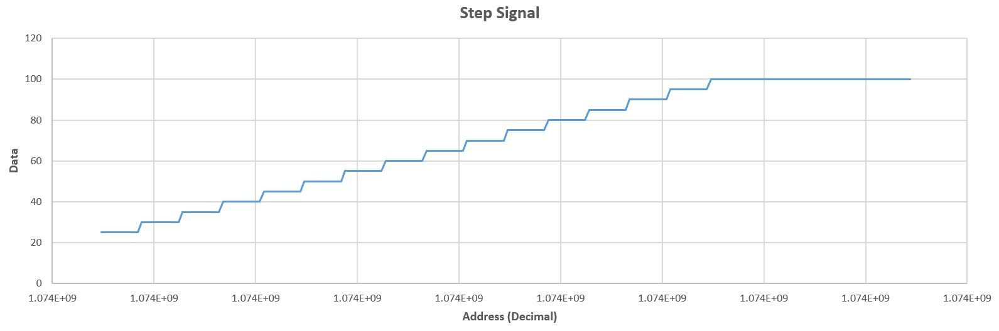
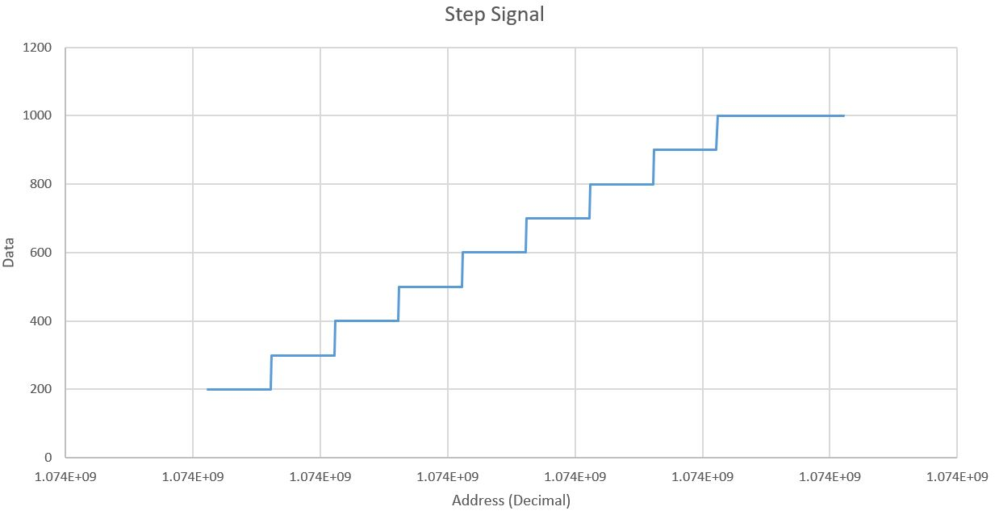

# Waveform Generator
### The system which is consist of  hardware and software generates a periodic waveform which is define by final value, drop value, step horizontal value, step vertical value and period .
-------------------------------------------------------------------------------------------------------------------
### Tools:  	
* Vivado 2019.1
* Xilinx SDK 2019.1
* TeraTerm 4.105
* EXCEL
### Device: 	
* Zedboard  
------------------------------------------------------------
### Hardware
* ARM Cortex A9 core (PS)
* UART for serial communication
* On chip memory (OCM)
* AXI interconnect block
* Reset module

------------------------------------------------------------
### Workflow

-------------------------------------------------------------------------------------------------------------
### Serial Communication Settings
* Connection type: Serial
* Port: COM4
* Baud Rate: 115200
* Data bits: 8
* Stop bits: 1
* Parity: None
* Flow Control: None
---------------------------------------------------------------------------------------------------------------
------------------------------------------------------------
### UART output and data table

* Final value = 20
* Drop value = 15
* Step horizontal value = 2
* Step vertical value = 1
* Period = 40

------------------------------------------------------------
### Output waveform

#### case 01
* Final value = 20
* Drop value = 15
* Step horizontal value = 2
* Step vertical value = 1
* Period = 40

#### case 02
* Final value = 100
* Drop value = 75
* Step horizontal value = 10
* Step vertical value = 5
* Period = 200

#### case 03
* Final value = 1000
* Drop value = 800
* Step horizontal value = 50
* Step vertical value = 100
* Period = 500

